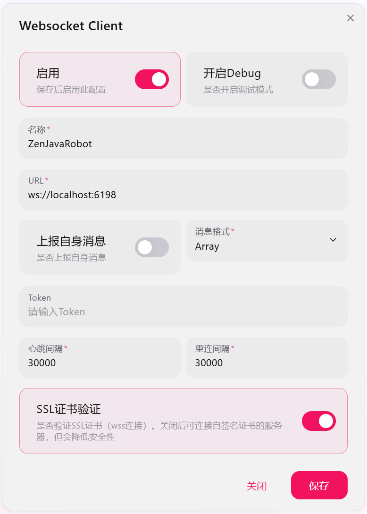

# NapCat的安装与配置

## 安装

运行`napcat.sh`，根据提示自动进行安装。推荐使用Rootless安装，并安装TUI-CLI。对应操作是在第一次询问时输入`n`，第二次询问时输入`y`（或者直接放着不动，默认就是这个设置）。

## 配置

（下面默认已安装TUI-CLI）
安装完成后，在终端输入`napcat`进入管理界面，根据提示添加QQ账户，并扫码登录QQ。

NapCat提示正在运行后，查看日志获取token，并登录`127.0.0.1:6099`，进入管理界面。

点击左侧“网络配置”，选择新建“WebSocket客户端”，参考如下配置。



## 测试

运行`run.sh`，如出现类似下面字段，则说明连接成功。

```
11:45:14.191 [INFO ] onebot.OneBotServer - OneBot WS client connected: self_id=*** from /127.0.0.1:11451 (Universal)
11:45:14.810 [INFO ] onebot.OneBotServer - QQ bot lifecycle: connect (self_id=***)
```